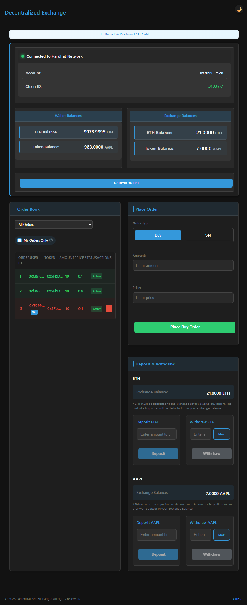
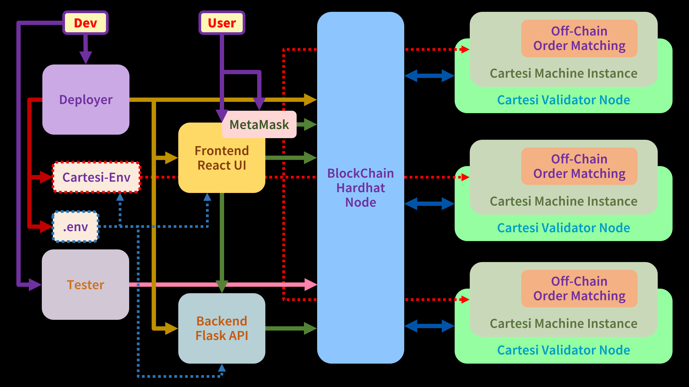
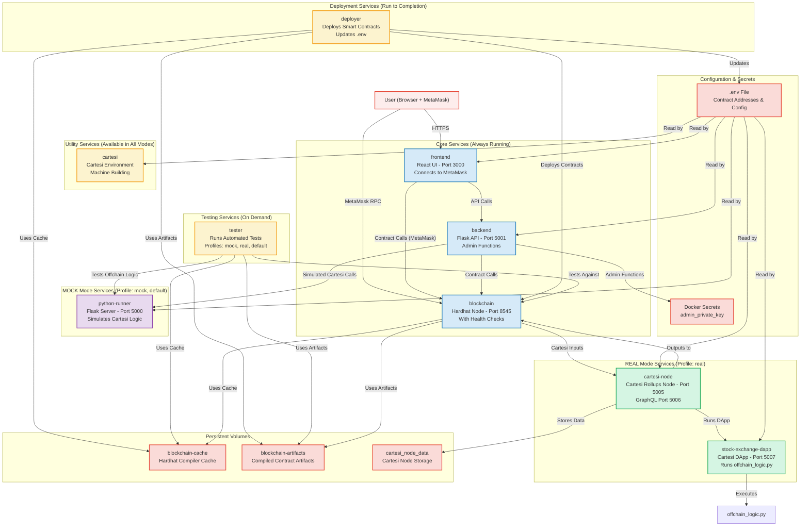
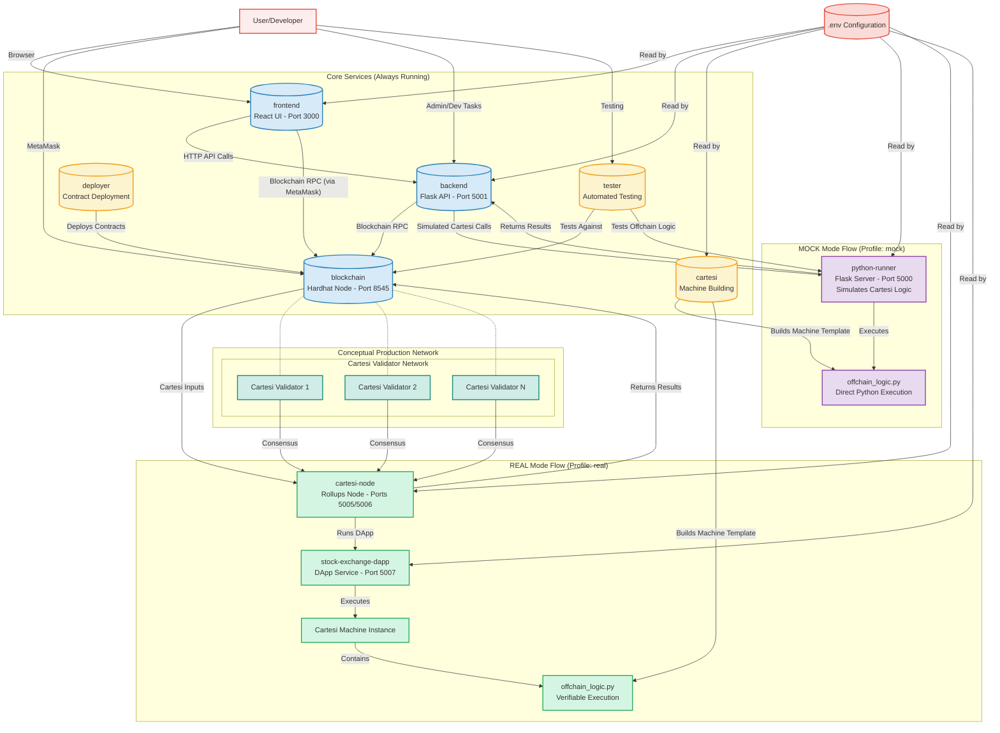
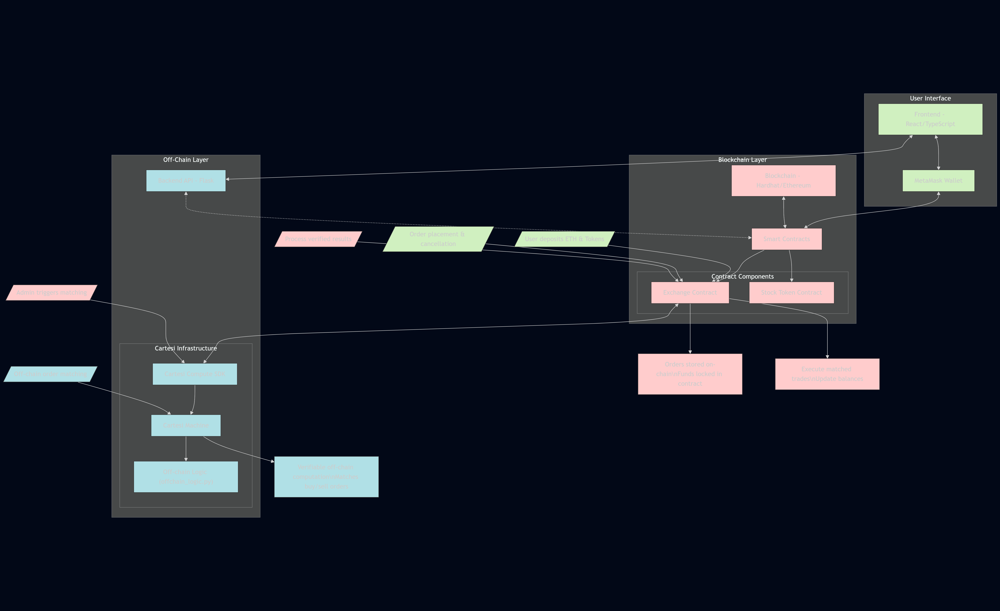
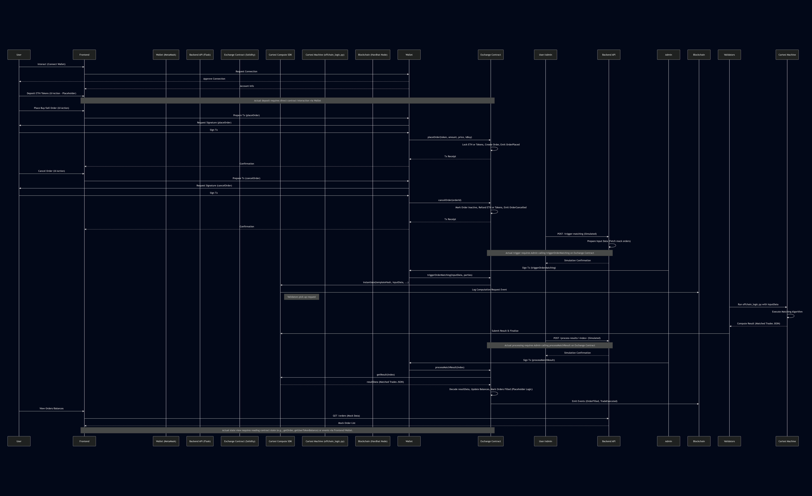
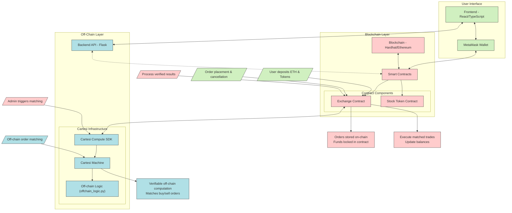
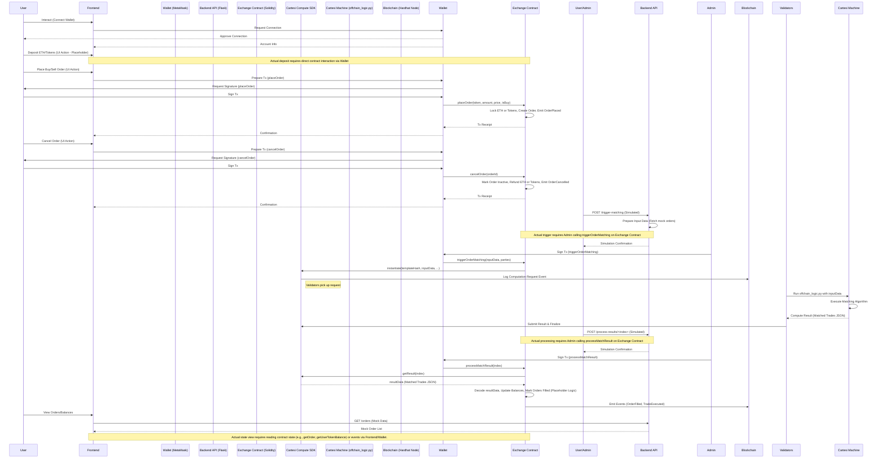
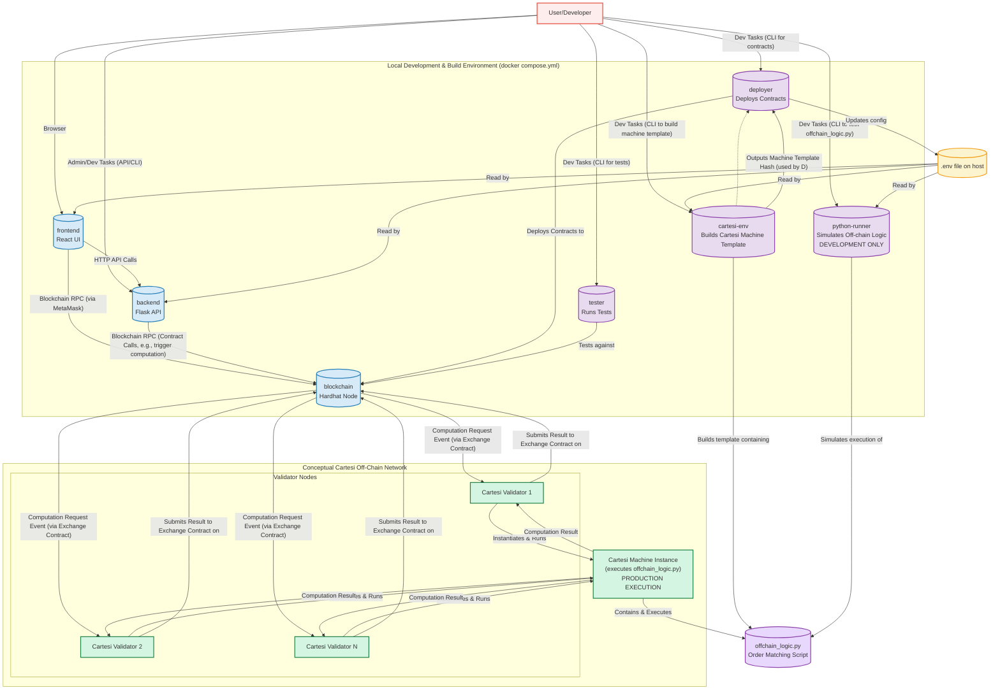

# Stock Token Exchange with Cartesi

This project implements a decentralized stock token exchange leveraging Cartesi for verifiable off-chain computation. The system supports both **MOCK mode** (for development/testing) and **REAL mode** (for production with actual Cartesi infrastructure) via Docker Compose profiles.

> **⚠️ IMPORTANT:** Docker permissions are required to run this project. Make sure you either run the scripts with `sudo` or add your user to the docker group with `sudo usermod -aG docker $USER` (requires logout/login to take effect).

## Overview

The exchange allows users to deposit ETH and specific stock tokens (like AAPL, represented as ERC20) into a smart contract. Buy and sell orders are placed on-chain, locking the necessary funds. The complex task of matching these orders is delegated to either:

* **MOCK Mode**: A Python Flask server (`python-runner`) that simulates Cartesi logic for rapid development
* **REAL Mode**: Actual Cartesi infrastructure (`cartesi-node` + `stock-exchange-dapp`) for production-ready verifiable computation

The system runs a Python script (`offchain_logic.py`) implementing a price-time priority matching algorithm. Once the computation is complete, an authorized admin triggers an on-chain function to process the results, updating user balances and order statuses.

## Deployment Modes

The project uses Docker Compose profiles to support different deployment scenarios:

* **MOCK Mode (Development)**: `docker compose --profile mock up` or `docker compose up`
* **REAL Mode (Production)**: `docker compose --profile real up`  
* **Both Modes (Testing)**: `docker compose --profile mock --profile real up`

## Frontend Design



## Overview: Containers Point of View



## Docker Container Architecture with Profile-Based Deployment

The system uses Docker Compose profiles to support different deployment modes. The following diagram illustrates the containers and their roles:



**Key Container Roles & Interactions:**

* **Core Services (Always Running):**
  * `blockchain`: Runs the local Hardhat Ethereum node with health checks. Uses persistent volumes for caching and artifacts. Supports proxy configuration for downloading Solidity compilers.
  * `frontend`: React-based user interface that connects to MetaMask and communicates with the backend API. Reads contract addresses from `.env` file.
  * `backend`: Flask API server that handles admin functions and blockchain interactions. Uses Docker secrets for secure private key management.

* **Deployment Services (Run to Completion):**
  * `deployer`: Deploys smart contracts to the blockchain and updates the `.env` file with contract addresses. Includes BOM removal and compilation steps.

* **Testing Services (On Demand):**
  * `tester`: Executes automated tests against deployed contracts. Automatically detects whether to run in MOCK or REAL mode based on available services. Uses profiles for different deployment scenarios.

* **MOCK Mode Services (Profiles: mock, default):**
  * `python-runner`: Flask server that simulates Cartesi logic execution. Provides HTTP endpoints for testing `offchain_logic.py` without full Cartesi infrastructure. Includes comprehensive test files and health checks.

* **REAL Mode Services (Profile: real):**
  * `cartesi-node`: Official Cartesi Rollups node that handles the actual Cartesi computation infrastructure. Connects to the blockchain and manages Cartesi machine execution.
  * `stock-exchange-dapp`: Cartesi DApp service that runs the actual `offchain_logic.py` script in production mode. Communicates with the Cartesi node and processes real order matching.

* **Utility Services (Available in All Modes):**
  * `cartesi`: Cartesi environment container for building machine templates. Provides instructions and tools for Cartesi development.

* **Persistent Volumes:**
  * `blockchain-cache`: Stores Hardhat's cache including downloaded Solidity compiler binaries (shared across blockchain, deployer, tester).
  * `blockchain-artifacts`: Stores compiled contract artifacts (shared across blockchain, deployer, tester).
  * `cartesi_node_data`: Stores Cartesi node data for the REAL mode implementation.

* **Configuration & Security:**
  * `.env` file: Contains contract addresses, network configuration, and proxy settings. Updated by deployer and read by all services.
  * Docker secrets: Secure storage for admin private keys used by the backend service.

## Network and Proxy Configuration

The project includes intelligent proxy handling for corporate environments that require HTTP proxies for external network access. Each service in the docker-compose.yml uses centralized proxy scripts (`scripts/setup-proxy.sh` and `scripts/cleanup-proxy.sh`) for consistent proxy management across all containers.

### Profile-Based Service Architecture

The system uses Docker Compose profiles to support different deployment modes:

* **MOCK Mode (Profile: mock, default)**: Uses `python-runner` service to simulate Cartesi logic
* **REAL Mode (Profile: real)**: Uses actual Cartesi infrastructure (`cartesi-node` + `stock-exchange-dapp`)
* **Mixed Mode**: Both profiles can run simultaneously for testing and comparison

### Data Flow by Mode



### Component Roles by Mode

#### Core Services (Always Running)

* **`frontend`**: React-based user interface with MetaMask integration
* **`backend`**: Flask API server with admin functions and blockchain interaction
* **`blockchain`**: Local Hardhat Ethereum node with health checks and persistent volumes

#### Deployment & Utility Services

* **`deployer`**: Contract deployment with automatic `.env` updates and artifact management
* **`tester`**: Automated testing with mode detection (MOCK/REAL) and comprehensive test suites
* **`cartesi`**: Cartesi environment for machine building and development instructions

#### MOCK Mode Services (Fast Development)

* **`python-runner`**: Flask server simulating Cartesi logic execution with direct Python script access
* **`offchain_logic.py`**: Direct execution of matching algorithm for rapid development and testing

#### REAL Mode Services (Production Ready)

* **`cartesi-node`**: Official Cartesi Rollups node with GraphQL endpoints and persistent data storage
* **`stock-exchange-dapp`**: Cartesi DApp service executing the matching algorithm in verifiable environment
* **`Cartesi Machine Instance`**: Isolated execution environment running `offchain_logic.py` with cryptographic verification

#### Production Network (Conceptual)

* **`Cartesi Validators`**: Distributed network of validators ensuring computation verification and consensus
* **Consensus Mechanism**: Multi-validator verification of computation results before blockchain submission

### Key Differences Between Modes

| Aspect | MOCK Mode | REAL Mode |
|--------|-----------|-----------|
| **Execution Environment** | Direct Python execution | Cartesi Machine (RISC-V) |
| **Verification** | None (simulation only) | Cryptographic proofs |
| **Performance** | Fast development cycles | Production-ready verification |
| **Use Case** | Development & testing | Production deployment |
| **Startup Time** | Quick (~30 seconds) | Longer (~60+ seconds) |
| **Dependencies** | Python + Flask | Cartesi infrastructure |

## Off-Chain Logic Execution Environments

The order matching logic (`offchain_logic.py`) can run in two distinct environments based on the Docker Compose profile selection:

### 1. MOCK Mode (Profile: mock, default)

**Purpose**: Fast development and testing without Cartesi infrastructure overhead

**Architecture**:

* The `python-runner` service runs the off-chain logic directly in a Flask server
* Provides HTTP endpoints on port 5000 that simulate Cartesi Machine behavior
* Changes to the matching algorithm can be tested immediately without rebuilding machine templates
* Includes comprehensive test suites and health checks

**Data Flow**:

* Input: HTTP requests with JSON order data from backend/frontend
* Processing: Direct Python execution of `offchain_logic.py`
* Output: HTTP responses with matched trade results
* No cryptographic verification (simulation only)

**Use Cases**:

* Rapid algorithm development and debugging
* Unit testing of matching logic
* Frontend integration testing
* Development environment where blockchain verification isn't required

### 2. REAL Mode (Profile: real)

**Purpose**: Production-ready execution with cryptographic verification

**Architecture**:

* `cartesi-node` service runs the official Cartesi Rollups infrastructure
* `stock-exchange-dapp` service manages the DApp execution environment
* `offchain_logic.py` executes inside a deterministic Cartesi Machine (RISC-V)
* Results are cryptographically verified by validator consensus

**Data Flow**:

* Input: ABI-encoded data from Exchange contract via blockchain events
* Processing: Verifiable execution inside Cartesi Machine
* Output: Cryptographically proven results submitted back to blockchain
* Full verification and dispute resolution capabilities

**Use Cases**:

* Production deployment with security guarantees
* Testing the complete Cartesi integration
* Demonstrating verifiable off-chain computation
* Preparing for mainnet deployment

### Technical Implementation Details

**Environment Detection**: The `tester` service automatically detects which mode is running by checking service availability:

```bash
# Checks for MOCK mode
if nc -z -w 1 python-runner 5000 2>/dev/null; then
  export INITIAL_CARTESI_MODE=mock
# Checks for REAL mode  
elif nc -z -w 1 cartesi-node 5005 2>/dev/null; then
  export INITIAL_CARTESI_MODE=real
fi
```

**Machine Template Building**: The `cartesi` service provides instructions for building Cartesi Machine templates that work in both development and production:

```bash
# Build the machine template
docker compose exec cartesi bash -c "cd cartesi-machine && ./build-machine.sh"
```

**Mode Switching**: You can easily switch between modes or run both simultaneously:

```bash
# MOCK mode only (default)
docker compose up

# REAL mode only
docker compose --profile real up

# Both modes for comparison
docker compose --profile mock --profile real up
```

### Technical Details of Data Flow Between Environments

As described in the order matching analysis document, there are two key functions that handle the data flow between the smart contract and the off-chain computation:

1. **`triggerOrderMatching`/`triggerCartesiComputation`**: Collects active orders and sends them to Cartesi for matching
   * Orders are ABI-encoded in the smart contract before being passed to the Cartesi Machine
   * The Python script in the Cartesi Machine must decode this ABI-encoded input data

2. **`processMatchResult`**: Receives the results of the matching algorithm and applies them to the blockchain state
   * Validates that the computation was properly executed and verified by Cartesi
   * Decodes the matching results and processes the trades on-chain
   * Updates order statuses and user balances based on the matched trades

This data flow ensures that complex order matching operations can be performed off-chain while still being verifiable on-chain, combining the efficiency of off-chain computation with the security of blockchain.

## Project Structure

### Architecture Diagrams



### Detailed Sequence Diagram



## Key Components

* **Docker (`docker compose.yml`, `backend/Dockerfile`):** Defines the multi-container environment including a local blockchain, contract deployer, backend API, frontend server, and a Cartesi playground container for building/interacting with the Cartesi machine.
* **Solidity Contracts (`contracts/`):**
  * `StockToken.sol`: A standard ERC20 token contract (using OpenZeppelin) representing a tradable stock (e.g., AAPL). Includes an `Ownable` `mint` function.
  * `Exchange.sol`: The core contract managing deposits/withdrawals (ETH & Tokens), order placement (`placeOrder`) and cancellation (`cancelOrder`) which lock/refund funds respectively, unique order ID generation, and interaction with the Cartesi Compute SDK to trigger (`triggerOrderMatching`) and process (`processMatchResult`) off-chain order matching. Contains placeholders for Cartesi input data construction and result decoding/processing.
* **Deployment (`deploy/`, `hardhat.config.ts`):** Scripts and configuration for deploying contracts using Hardhat.
* **Cartesi Machine (`cartesi-machine/`):**
  * `offchain_logic.py`: Python script containing the order matching logic executed off-chain within the Cartesi Machine.
  * `build-machine.sh`: Script to build the Cartesi Machine template containing the `offchain_logic.py`. **(Requires Cartesi build tools)**
* **Backend (`backend/`):**
  * `server.py`: Python/Flask API server. Currently provides mock endpoints for viewing/submitting orders and simulating Cartesi trigger/result processing. Can be extended to interact with the blockchain.
* **Frontend (`frontend/`):**
  * `src/App.tsx`: TypeScript/React application providing the user interface. Connects to MetaMask, displays mock data, allows mock order placement via the backend API, and shows the mock order book.

## High-Level Architecture

The following diagram illustrates the high-level architecture and key components of the Stock Token Exchange system:



This architecture highlights how the system leverages both on-chain and off-chain components to achieve a scalable and verifiable trading platform:

1. **User Interaction Layer**: Users interact with the system through a web frontend, connecting their MetaMask wallet to deposit funds, place orders, and view balances.

2. **Blockchain Layer**: Smart contracts manage token operations, hold user funds in escrow, store order information, and execute verified trades.

3. **Off-Chain Layer**: Cartesi's off-chain computation handles the complex order matching algorithm, which would be prohibitively expensive to run directly on-chain.

4. **Verification Flow**: The critical aspect of this architecture is that while computation happens off-chain for efficiency, results are cryptographically verified on-chain, ensuring the same security guarantees as if the computation occurred entirely on the blockchain.

The Admin role serves as a bridge between on-chain and off-chain components, triggering the Cartesi computation and submitting results back to the blockchain after verification. This model provides a practical solution to the blockchain scalability trilemma by maintaining security and decentralization while improving throughput.

## Data Flow with Cartesi



## Technical Architecture Deep Dive

This section provides a detailed explanation of the system's core components, their responsibilities, interactions, and the key technical concepts that enable the decentralized stock exchange.

### Smart Contract Architecture

#### StockToken.sol

This contract implements an ERC20 token representing a stock, with the following key features:

* **Standard ERC20 Functionality**: Implemented using OpenZeppelin's trusted libraries
* **Minting Capability**: The contract owner can mint new tokens to specific addresses
* **Access Control**: Ownable pattern restricts minting capabilities to the contract owner

#### Exchange.sol

This is the core contract that coordinates the entire exchange functionality:

1. **Balance Management**
   * `deposits` mapping: Tracks token balances for each user (tokenAddress → user → amount)
   * `ethDeposits` mapping: Tracks ETH balances for each user (user → amount)
   * `depositETH()`: Allows users to deposit ETH into the exchange
   * `withdrawETH(amount)`: Allows users to withdraw ETH from the exchange
   * `depositToken(tokenAddress, amount)`: Handles token deposits, requiring prior approval
   * `withdrawToken(tokenAddress, amount)`: Processes token withdrawals

2. **Order Management**
   * `Order` struct: Stores all order details (id, user, token, amount, price, isBuyOrder, active)
   * `orders` mapping: Maps order IDs to Order structs
   * `_orderIds` counter: Generates unique sequential IDs for orders
   * `placeOrder(tokenAddress, amount, price, isBuyOrder)`:
     * Creates a new order
     * Locks the appropriate assets (ETH for buy orders, tokens for sell orders)
     * Emits `OrderPlaced` event with order details
   * `cancelOrder(orderId)`:
     * Cancels an active order
     * Refunds locked assets to the user
     * Emits `OrderCancelled` event

3. **Cartesi Integration**
   * `cartesiCompute`: Interface to interact with the Cartesi Compute SDK
   * `cartesiTemplateHash`: Hash identifying the specific Cartesi Machine template to use
   * `triggerOrderMatching(maxOrders, parties)`:
     * Collects active buy and sell orders (up to `maxOrders` limit)
     * Formats order data for the Cartesi Machine
     * Creates a Cartesi drive with the input data
     * Instantiates a Cartesi computation and returns its index
     * Emits `ComputationRequested` event
   * `processMatchResult(index)`:
     * Retrieves and validates the computation result from Cartesi
     * Decodes the matched trades from the result data
     * Processes each matched trade:
       * Validates order states and trade parameters
       * Updates order states (amount remaining, active status)
       * Transfers assets between buyers and sellers
       * Emits `TradeExecuted` event for each processed trade

4. **View Functions**
   * `getOrder(orderId)`: Returns full details of a specific order
   * `getUserTokenBalance(user, tokenAddress)`: Returns a user's token balance in the exchange
   * `getUserEthBalance(user)`: Returns a user's ETH balance in the exchange

### Cartesi Off-chain Computation

The off-chain computation in Cartesi allows for complex matching algorithms that would be prohibitively expensive to run directly on-chain. This provides scalability while maintaining the security guarantees of blockchain.

#### offchain_logic.py

This Python script implements the price-time priority matching algorithm:

1. **Input Format**

   ```json
   {
     "buy_orders": [
       {"id": 1, "user": "0x...", "token": "0x...", "amount": 100, "price": 50, "active": true},
       ...
     ],
     "sell_orders": [
       {"id": 2, "user": "0x...", "token": "0x...", "amount": 150, "price": 49, "active": true},
       ...
     ]
   }
   ```

2. **Matching Algorithm**
   * **Token Grouping**: Orders are first grouped by token address
   * **Price-Time Priority**:
     * Buy orders are sorted by highest price first
     * Sell orders are sorted by lowest price first
     * Orders at the same price are prioritized by time (order ID as proxy)
   * **Matching Process**:
     * For each token, iterate through sorted buy and sell orders
     * Match orders when buy price ≥ sell price
     * Execute trades at the seller's asking price
     * Handle partial fills by updating remaining amounts
     * Continue until no more matches are possible

3. **Output Format**

   ```json
   [
     {
       "buyOrderId": 1,
       "sellOrderId": 2,
       "token": "0x...",
       "amount": 100,
       "price": 49
     },
     ...
   ]
   ```

4. **Cartesi Machine Integration**
   * The Cartesi Machine runs this Python script in a deterministic Linux environment
   * Input data is read from a designated virtual drive
   * Output is written to a standard output location
   * The execution is verifiable via RISC-V proofs

### Cartesi-Ethereum Interaction Flow

The interaction between Ethereum and Cartesi involves several key steps:

1. **Cartesi Machine Creation**
   * A Cartesi Machine template is built with the matching algorithm
   * The template hash is stored in the Exchange contract
   * The `build-machine.sh` script handles machine creation and captures the template hash

2. **Computation Triggering**
   * Admin calls `triggerOrderMatching()` on the Exchange contract
   * Contract collects active orders and ABI-encodes them
   * Data is passed to Cartesi via drives (input drive)
   * Cartesi Compute SDK initializes the computation

3. **Off-chain Computation**
   * Validators run the Cartesi Machine with the provided input
   * The matching algorithm processes orders and produces trade matches
   * Results are written to the designated output location
   * Validators reach consensus on the computation result

4. **Result Verification & Processing**
   * Results are made available through the Cartesi Compute SDK
   * Admin calls `processMatchResult()` on the Exchange contract
   * Contract verifies and decodes the results
   * Trades are executed on-chain, updating balances and order states

5. **Security Guarantee**
   * The Cartesi Machine execution is deterministic
   * Results can be verified through cryptographic proofs
   * Disputes can be resolved by rerunning specific computation steps
   * This enables complex computation while maintaining blockchain security guarantees

### Backend API Architecture

The Flask-based backend API serves multiple roles:

1. **Blockchain Interface**
   * Connects to Ethereum node via Web3.py
   * Reads contract state (orders, balances) directly from the blockchain
   * Triggers Cartesi computations as admin
   * Processes computation results

2. **Mock Mode**
   * Provides mock data when blockchain connection is unavailable
   * Simulates order placement and matching for development
   * Maintains a simple in-memory database of orders

3. **Security Features**
   * Layered admin key management (Docker secrets, key file, env var)
   * Permission validation for admin operations
   * Input validation and error handling

4. **Endpoints**
   * `/orders`: Get active orders, place new orders (mock)
   * `/user/<address>/balances`: Get user balances
   * `/trigger-matching`: Trigger Cartesi computation
   * `/process-results/<index>`: Process Cartesi results

### Frontend Architecture

The React-based frontend provides the user interface:

1. **Web3 Integration**
   * Connects to MetaMask wallet
   * Interacts directly with smart contracts via ethers.js
   * Handles transaction signing and confirmation

2. **State Management**
   * Tracks user balances, orders, and transaction history
   * Provides form validation for user inputs
   * Manages notifications and error messages

3. **UI Components**
   * Deposit/withdraw interface
   * Order placement form
   * Order book display with filtering options
   * Transaction history

4. **Fallback Mechanism**
   * Falls back to backend API for data when direct contract access fails
   * Provides simulation options for development environment

### Data Flow in Detail

1. **Order Placement**
   * User enters order details in the frontend
   * Frontend prepares transaction via ethers.js
   * User signs the transaction with MetaMask
   * Exchange contract locks assets and creates the order
   * Frontend updates to show the new order

2. **Order Matching Process**
   * Admin initiates matching via backend or direct contract interaction
   * Exchange contract collects active orders
   * Cartesi computation processes the matching algorithm
   * Validators reach consensus on the result
   * Admin submits the result back to the Exchange contract
   * Contract processes trades and updates state
   * Events are emitted for each trade

3. **Blockchain Event Handling**
   * Frontend listens for relevant events (OrderPlaced, OrderCancelled, TradeExecuted)
   * Updates UI based on event data
   * Refreshes balances after state-changing events

### Security Considerations

1. **Smart Contract Security**
   * Reentrancy protection in withdrawal functions
   * Balance checks before operations
   * Proper authorization controls

2. **Admin Key Management**
   * Layered approach to key storage
   * Docker secrets for production
   * File permissions restrictions

3. **Input Validation**
   * Frontend validation for user inputs
   * Backend validation for API requests
   * Contract-level validation for transactions

4. **Cartesi Verification**
   * Cryptographic verification of computation results
   * Consensus mechanism for result finalization
   * Dispute resolution capability

## Setup and Usage (Docker)

This project uses Docker Compose to simplify setup and running all components.

### Prerequisites

* **Docker:** Install Docker Desktop or Docker Engine.
* **Docker Compose:** Usually included with Docker Desktop.
* **Node.js / npm:** Needed for initial dependency installation within containers.
* **Git:** To clone the repository.
* **MetaMask:** Browser extension wallet.

### Installation & Running

1. **Clone the Repository:**

    ```bash
    git clone <your-repo-url>
    cd cartesi-stock-exchange
    ```

2. **Configure Admin Private Key:**
    The backend server uses a private key to perform administrative functions like triggering order matching and processing results. This key is securely managed using Docker secrets.

    You can either:
    * Use the default key in `secrets/admin_private_key.txt` (already set to the first Hardhat test account)
    * Replace it with your own key:

      ```bash
      echo "YOUR_PRIVATE_KEY" > secrets/admin_private_key.txt
      ```

    Make sure the key file has restricted permissions:

    ```bash
    chmod 600 secrets/admin_private_key.txt
    ```

3. **Choose Your Deployment Mode:**
    
    The project supports different deployment modes via Docker Compose profiles:

    **MOCK Mode (Default - Fast Development):**
    
    ```bash
    docker compose up --build -d
    # or explicitly
    docker compose --profile mock up --build -d
    ```

    **REAL Mode (Production-Ready Cartesi):**
    
    ```bash
    docker compose --profile real up --build -d
    ```

    **Both Modes (Testing & Comparison):**
    
    ```bash
    docker compose --profile mock --profile real up --build -d
    ```

    Each mode starts different services:
    
    * **Common Services (All Modes)**:
        * Hardhat blockchain node (`blockchain`) on port 8545
        * Contract deployer (`deployer`) - runs once to completion
        * Flask backend API (`backend`) on port 5001
        * React frontend (`frontend`) on port 3000
        * Cartesi environment (`cartesi`) for machine building

    * **MOCK Mode Additional Services**:
        * Python runner (`python-runner`) on port 5000 - simulates Cartesi logic

    * **REAL Mode Additional Services**:
        * Cartesi node (`cartesi-node`) on ports 5005/5006 - actual Cartesi infrastructure  
        * Stock exchange DApp (`stock-exchange-dapp`) on port 5007 - runs verifiable computation

4. **Check Deployment:**
    View the logs of the deployer service to see the contract deployment output and addresses:

    ```bash
    docker compose logs deployer
    ```

    *Note: The deployer service currently uses a placeholder Cartesi template hash. You'll need to build the machine and update this.*

5. **Configure MetaMask:**
    * Add a new network to MetaMask:
        * Network Name: `Hardhat Local`
        * New RPC URL: `http://localhost:8545`
        * Chain ID: `31337`
        * Currency Symbol: `ETH`
    * Import a Hardhat default account using its private key (e.g., `0xac0974bec39a17e36ba4a6b4d238ff944bacb478cbed5efcae784d7bf4f2ff80`) to have funds on the local network.

6. **Access Frontend:**
    Open your browser and navigate to `http://localhost:3000`.

7. **Interact:**
    * Connect your configured MetaMask wallet to the frontend.
    * Use the UI to place mock orders (via the backend API).
    * View the mock order book.
    * *(Optional)* Use tools like `curl` or Postman to interact with the backend API endpoints (`http://localhost:5001`) like `/orders`, `/trigger-matching`, `/process-results/<index>`.
    * *(Advanced)* Interact directly with the deployed contracts using Hardhat console or scripts.

### Building the Cartesi Machine (For REAL Mode)

**Note**: Machine building is only required if you plan to use REAL mode with actual Cartesi infrastructure.

1. **Access the Cartesi Container:**

    ```bash
    docker compose exec cartesi bash
    ```

2. **Build the Machine Template:**
    Inside the container's shell:

    ```bash
    cd /app/stock-token-exchange/cartesi-machine
    # Ensure build script has execute permissions
    chmod +x build-machine.sh
    ./build-machine.sh
    ```

    The script will:
    * Build a Cartesi Machine template containing `offchain_logic.py`
    * Output a template hash for use in contract deployment
    * Store the machine template for REAL mode execution

3. **Update Template Hash (If Building Custom Machine):**
    * Copy the `templateHash` output by the build script
    * Update the deployment configuration with the new hash
    * Restart services to use the updated configuration

### Profile-Specific Testing

**Test MOCK Mode:**

```bash
# Start MOCK mode services
docker compose --profile mock up -d

# Run tests that will automatically detect MOCK mode
docker compose exec tester npx hardhat test --network localhost
```

**Test REAL Mode:**

```bash
# Start REAL mode services (includes Cartesi infrastructure)
docker compose --profile real up -d

# Wait for services to be healthy, then run tests
docker compose exec tester npx hardhat test --network localhost
```

**Compare Both Modes:**

```bash
# Start both modes simultaneously
docker compose --profile mock --profile real up -d

# Tests will detect available services and can compare results
docker compose exec tester npx hardhat test --network localhost
```

### Stopping Services

Stop all services regardless of profile:

```bash
docker compose down
```

Clean up volumes and networks:

```bash
docker compose down -v
```

## Backend API Documentation

The backend API provides several endpoints to interact with the stock exchange system. This API serves both as a convenience layer for the frontend and as a simulation layer for Cartesi operations during development.

### Base URL

```text
http://localhost:5001
```

### Available Endpoints

#### Orders Management

##### GET `/orders`

Retrieves all active orders in the exchange.

**Response:**

```json
[
  {
    "id": 1,
    "user": "0x123...",
    "token": "0xabc...",
    "amount": 100,
    "price": 1500000,
    "isBuyOrder": true,
    "active": true
  },
  ...
]
```

##### GET `/orders/{order_id}`

Retrieves a specific order by ID.

**Parameters:**

* `order_id`: The unique identifier of the order

**Response:**

```json
{
  "id": 1,
  "user": "0x123...",
  "token": "0xabc...",
  "amount": 100,
  "price": 1500000,
  "isBuyOrder": true,
  "active": true
}
```

##### POST `/orders`

Simulates placing a new order. In a real scenario, orders would be placed directly via the smart contract from a user's wallet.

**Request Body:**

```json
{
  "user": "0x123...",
  "token": "0xabc...",
  "amount": 100,
  "price": 1500000,
  "isBuyOrder": true
}
```

**Response:**

```json
{
  "status": "received (mock)",
  "order": {
    "id": 1,
    "user": "0x123...",
    "token": "0xabc...",
    "amount": 100,
    "price": 1500000,
    "isBuyOrder": true,
    "active": true
  }
}
```

#### User Data

##### GET `/user/{address}/balances`

Retrieves a user's ETH and token balances.

**Parameters:**

* `address`: The Ethereum address of the user

**Response:**

```json
{
  "eth": 1000000000000000000,
  "tokens": {
    "0xabc...": 500,
    "0xdef...": 200
  }
}
```

#### Cartesi Operations

##### POST `/trigger-matching`

Triggers the order matching computation via Cartesi. In production, this would be called by an admin.

**Request Body:**

```json
{
  "max_orders": 100
}
```

`max_orders` is optional and defaults to the value in `MAX_ORDERS_PER_BATCH` environment variable.

**Response (real mode):**

```json
{
  "status": "success",
  "txHash": "0x123...",
  "blockNumber": 123456,
  "cartesiIndex": 5
}
```

**Response (simulation mode):**

```json
{
  "status": "simulated trigger"
}
```

##### POST `/process-results/{cartesi_index}`

Processes the results of a Cartesi computation. In production, this would be called by an admin after the computation is finalized.

**Parameters:**

* `cartesi_index`: The index of the Cartesi computation to process

**Response (real mode):**

```json
{
  "status": "success",
  "txHash": "0x123...",
  "blockNumber": 123456,
  "tradesProcessed": 3
}
```

**Response (simulation mode):**

```json
{
  "status": "simulated result processing"
}
```

#### Administration

##### POST `/admin/sync-blockchain`

Synchronizes the backend's mock database with the current blockchain state.

**Response:**

```json
{
  "status": "success",
  "message": "Synced mock DB with blockchain state"
}
```

### Working Modes

The API can operate in two modes:

1. **Real Mode**: In this mode, the API interacts with the actual blockchain contracts. Requires proper configuration of Web3 provider URL and admin private key.

2. **Simulation Mode**: When blockchain connection is unavailable, the API falls back to a mock database. This is useful for development and testing without a blockchain.

### Configuration

The API's behavior is controlled through these environment variables:

* `EXCHANGE_CONTRACT_ADDRESS`: Address of the deployed Exchange contract
* `NODE_URL`: URL of the Ethereum node (default: `http://localhost:8545`)
* `MAX_ORDERS_PER_BATCH`: Maximum number of orders to include in a matching batch (default: `100`)
* `ADMIN_PRIVATE_KEY`: Private key for the admin account (alternatively loaded from Docker secret)

Note: For security in production environments, the admin private key should be provided via Docker secrets rather than environment variables.

## Configuration Parameters

The Stock Token Exchange system uses various environment variables to configure its components. These parameters are stored in a `.env` file at the project root and are loaded by each component as needed. Below is a detailed explanation of all available configuration parameters and their effects on the system.

### Core Configuration

| Parameter | Description | Default | Used By |
|-----------|-------------|---------|---------|
| `EXCHANGE_CONTRACT_ADDRESS` | The Ethereum address of the deployed Exchange contract | - | Backend, Frontend |
| `STOCK_TOKEN_ADDRESS` | The Ethereum address of the deployed StockToken contract | - | Backend, Frontend |
| `CARTESI_TEMPLATE_HASH` | The hash of the Cartesi Machine template used for off-chain computation | - | Contract Deployment |
| `NODE_URL` | URL of the Ethereum node for blockchain interaction | `http://localhost:8545` | Backend |
| `CONTRACT_CHAIN_ID` | Chain ID where the contracts are deployed | `31337` (Hardhat local) | Frontend |

### Backend Specific Parameters

| Parameter | Description | Default | Used By |
|-----------|-------------|---------|---------|
| `ADMIN_PRIVATE_KEY` | Private key for the admin account that triggers Cartesi operations | - | Backend |
| `ADMIN_KEY_FILE` | Path to a file containing the admin private key (alternative to direct env var) | - | Backend |
| `MAX_ORDERS_PER_BATCH` | Maximum number of orders to include in a matching batch | `100` | Backend |
| `FLASK_ENV` | Environment mode for Flask (development/production) | `development` | Backend |
| `FLASK_DEBUG` | Enable/disable Flask debug mode | `True` | Backend |

### Smart Contract Deployment Parameters

| Parameter | Description | Default | Used By |
|-----------|-------------|---------|---------|
| `DEPLOYER_PRIVATE_KEY` | Private key used for deploying contracts | Hardhat's first test account | Contract Deployment |
| `INITIAL_MINT_AMOUNT` | Initial amount of stock tokens to mint during deployment | `1000000000000000000000` (1000 tokens) | Contract Deployment |
| `INITIAL_ETH_DEPOSIT` | Initial ETH deposit to the Exchange contract during deployment | `1000000000000000000` (1 ETH) | Contract Deployment |

### Frontend Specific Parameters

| Parameter | Description | Default | Used By |
|-----------|-------------|---------|---------|
| `REACT_APP_BACKEND_URL` | URL of the backend API service | `http://localhost:5001` | Frontend |
| `REACT_APP_NETWORK_NAME` | Display name for the network | `Hardhat Local` | Frontend |
| `REACT_APP_USE_MOCK` | Flag to use mock data instead of blockchain data | `false` | Frontend |

### Docker Configuration

| Parameter | Description | Default | Used By |
|-----------|-------------|---------|---------|
| `COMPOSE_PROJECT_NAME` | Name prefix for Docker containers created by docker compose | `cartesi-stock-exchange` | Docker Compose |
| `BACKEND_PORT` | Port on which the backend API is exposed | `5001` | Docker Compose |
| `FRONTEND_PORT` | Port on which the frontend web app is exposed | `3000` | Docker Compose |
| `BLOCKCHAIN_PORT` | Port on which the local Hardhat node is exposed | `8545` | Docker Compose |

### Configuration Security Best Practices

* **Admin Private Key**: For production environments, use the Docker secret or external key file methods rather than environment variables to store the admin private key.
* **File Permissions**: Ensure that any file containing private keys has restricted permissions (e.g., `chmod 600 secrets/admin_private_key.txt`).
* **Network Selection**: Be aware that the `CONTRACT_CHAIN_ID` must match the actual network where your contracts are deployed, otherwise the frontend will display a warning.

### Configuration Update Process

When contracts are deployed or redeployed, the `update-env.sh` script is used to automatically update the relevant parameters in the `.env` file:

```bash
./update-env.sh --exchange-address 0x123... --token-address 0x456... --template-hash 0x789...
```

This ensures that all components use the correct contract addresses and Cartesi template hash without manual configuration.

## Example Walkthrough

This walkthrough provides a complete end-to-end example of setting up and using the Stock Token Exchange with Cartesi, including deployment, order placement, matching, and result processing.

### 1. Setup Environment

First, ensure all prerequisites are installed and the project is properly configured:

```bash
# Clone the repository and navigate to the project directory
git clone https://github.com/your-username/cartesi-stock-exchange.git
cd cartesi-stock-exchange

# Ensure admin private key file exists (using Hardhat default test account for demo)
echo "0xac0974bec39a17e36ba4a6b4d238ff944bacb478cbed5efcae784d7bf4f2ff80" > secrets/admin_private_key.txt
chmod 600 secrets/admin_private_key.txt

# Start all services
docker compose up --build -d
```

### 2. Deploy Contracts

Contracts are automatically deployed by the `deployer` service when Docker Compose starts. You can check the logs to see the deployment results:

```bash
docker compose logs deployer
```

Expected output:

```text
deployer_1  | Deploying StockToken...
deployer_1  | StockToken deployed at: 0x5FbDB2315678afecb367f032d93F642f64180aa3
deployer_1  | Deploying Exchange...
deployer_1  | Exchange deployed at: 0xe7f1725E7734CE288F8367e1Bb143E90bb3F0512
deployer_1  | Minting initial tokens: 1000 STOCK
deployer_1  | Depositing 1 ETH to Exchange
deployer_1  | Initial setup completed successfully!
deployer_1  | Updating .env file with contract addresses...
deployer_1  | Environment file updated successfully!
```

The script automatically updates the `.env` file with the deployed contract addresses. For manual deployment, you can use:

```bash
cd stock-token-exchange
npx hardhat run deploy/01_deploy_contracts.ts --network localhost
```

### 3. Configure Frontend

Verify that the frontend is using the correct contract addresses:

```bash
cat stock-token-exchange/frontend/src/deployments/index.ts
```

If necessary, update the addresses manually or run the export script:

```bash
cd stock-token-exchange
npx ts-node scripts/export-deployments.ts
```

### 4. Configure MetaMask

1. Add the local Hardhat network to MetaMask:
   * Network Name: `Hardhat Local`
   * RPC URL: `http://localhost:8545`
   * Chain ID: `31337`
   * Currency Symbol: `ETH`

2. Import test accounts:
   * **Admin/Owner Account**: `0xac0974bec39a17e36ba4a6b4d238ff944bacb478cbed5efcae784d7bf4f2ff80`
   * **Alice (Buyer)**: `0x59c6995e998f97a5a0044966f0945389dc9e86dae88c7a8412f4603b6b78690d`
   * **Bob (Seller)**: `0x5de4111afa1a4b94908f83103eb1f1706367c2e68ca870fc3fb9a804cdab365a`

### 5. Mint and Distribute Tokens

For our example, let's distribute tokens to Bob (the seller):

```bash
npx hardhat --network localhost run scripts/mint-tokens.js
```

Alternatively, you can use the Hardhat console:

```bash
npx hardhat --network localhost console
```

```javascript
// Connect to StockToken contract
const StockToken = await ethers.getContractFactory("StockToken");
const stockToken = await StockToken.attach("0x5FbDB2315678afecb367f032d93F642f64180aa3");

// Get signers (addresses)
const [owner, alice, bob] = await ethers.getSigners();

// Mint 100 tokens to Bob
await stockToken.connect(owner).mint(bob.address, ethers.utils.parseEther("100"));
console.log(`Bob's token balance: ${ethers.utils.formatEther(await stockToken.balanceOf(bob.address))}`);
```

### 6. Deposit Funds to Exchange

#### 6.1. Deposit ETH (for Alice - Buyer)

Access the frontend at `http://localhost:3000` using Alice's account in MetaMask:

1. Connect wallet
2. Enter `5` in the deposit amount field
3. Click "Deposit ETH"
4. Confirm the transaction in MetaMask

Alternatively, deposit via the console:

```javascript
const Exchange = await ethers.getContractFactory("Exchange");
const exchange = await Exchange.attach("0xe7f1725E7734CE288F8367e1Bb143E90bb3F0512");

// Deposit 5 ETH from Alice
await exchange.connect(alice).depositETH({ value: ethers.utils.parseEther("5") });
console.log(`Alice's ETH balance in exchange: ${ethers.utils.formatEther(await exchange.getUserEthBalance(alice.address))}`);
```

#### 6.2. Deposit Tokens (for Bob - Seller)

Using Bob's account in MetaMask:

1. Connect wallet
2. Enter `50` in the deposit amount field
3. Click "Deposit STOCK"
4. Confirm two transactions in MetaMask (token approval and deposit)

Via console:

```javascript
// Approve token transfer
await stockToken.connect(bob).approve(exchange.address, ethers.utils.parseEther("50"));

// Deposit tokens
await exchange.connect(bob).depositToken(stockToken.address, ethers.utils.parseEther("50"));
console.log(`Bob's token balance in exchange: ${ethers.utils.formatEther(await exchange.getUserTokenBalance(bob.address, stockToken.address))}`);
```

### 7. Place Orders

#### 7.1. Place Buy Order (Alice)

Using Alice's account in the frontend:

1. Enter `10` for Amount (STOCK)
2. Enter `0.1` for Price (ETH per STOCK)
3. Click "Place Buy Order"
4. Confirm the transaction in MetaMask

Via console:

```javascript
// Place buy order: 10 tokens at 0.1 ETH each
await exchange.connect(alice).placeOrder(
  stockToken.address,
  ethers.utils.parseEther("10"),  // amount
  ethers.utils.parseEther("0.1"), // price
  true                           // isBuyOrder
);
console.log("Buy order placed");
```

Expected result: Order ID #1 is created, and 1 ETH (10 tokens × 0.1 ETH) is locked in the contract.

#### 7.2. Place Sell Order (Bob)

Using Bob's account in the frontend:

1. Enter `10` for Amount (STOCK)
2. Enter `0.1` for Price (ETH per STOCK)
3. Click "Place Sell Order"
4. Confirm the transaction in MetaMask

Via console:

```javascript
// Place sell order: 10 tokens at 0.1 ETH each
await exchange.connect(bob).placeOrder(
  stockToken.address,
  ethers.utils.parseEther("10"),  // amount
  ethers.utils.parseEther("0.1"), // price
  false                          // isBuyOrder
);
console.log("Sell order placed");
```

Expected result: Order ID #2 is created, and 10 tokens are locked in the contract.

### 8. Verify Order State

Check that the orders are correctly placed and active:

```bash
curl http://localhost:5001/orders
```

Expected output:

```json
[
  {
    "id": 1,
    "user": "0x70997970C51812dc3A010C7d01b50e0d17dc79C8",
    "token": "0x5FbDB2315678afecb367f032d93F642f64180aa3",
    "amount": 10,
    "price": 0.1,
    "isBuyOrder": true,
    "active": true
  },
  {
    "id": 2,
    "user": "0x3C44CdDdB6a900fa2b585dd299e03d12FA4293BC",
    "token": "0x5FbDB2315678afecb367f032d93F642f64180aa3",
    "amount": 10,
    "price": 0.1,
    "isBuyOrder": false,
    "active": true
  }
]
```

Via console:

```javascript
const order1 = await exchange.getOrder(1);
console.log("Order 1:", { 
  user: order1.user, 
  amount: ethers.utils.formatEther(order1.amount), 
  price: ethers.utils.formatEther(order1.price), 
  isBuyOrder: order1.isBuyOrder, 
  active: order1.active 
});

const order2 = await exchange.getOrder(2);
console.log("Order 2:", { 
  user: order2.user, 
  amount: ethers.utils.formatEther(order2.amount), 
  price: ethers.utils.formatEther(order2.price), 
  isBuyOrder: order2.isBuyOrder, 
  active: order2.active 
});
```

### 9. Trigger Order Matching via Cartesi

As an admin, trigger the Cartesi computation for order matching:

```bash
curl -X POST http://localhost:5001/trigger-matching
```

Expected output:

```json
{
  "status": "success",
  "txHash": "0x123...",
  "blockNumber": 123456,
  "cartesiIndex": 5
}
```

Via console:

```javascript
// Trigger order matching with the admin account
const admin = owner; // First account is admin/owner
const tx = await exchange.connect(admin).triggerOrderMatching(100, [admin.address]);
const receipt = await tx.wait();
console.log(`Order matching triggered: ${tx.hash}`);

// Find the Cartesi index from the emitted event
const event = receipt.events.find(e => e.event === 'ComputationRequested');
const cartesiIndex = event.args.cartesiIndex.toNumber();
console.log(`Cartesi computation index: ${cartesiIndex}`);
```

This initiates a Cartesi computation that will match orders based on the offchain_logic.py algorithm.

### 10. Process Matching Results

Once the Cartesi computation is complete, process the results:

```bash
curl -X POST http://localhost:5001/process-results/0
```

Expected output:

```json
{
  "status": "success",
  "txHash": "0x456def...",
  "blockNumber": 12346,
  "tradesProcessed": 1
}
```

Via console:

```javascript
// Process the matching results
const processTx = await exchange.connect(admin).processMatchResult(cartesiIndex);
const processReceipt = await processTx.wait();
console.log(`Results processed: ${processTx.hash}`);

// Find trade events
const tradeEvents = processReceipt.events.filter(e => e.event === 'TradeExecuted');
console.log(`Number of trades executed: ${tradeEvents.length}`);
```

### 11. Verify Final State

Check the final state of the orders and balances after matching:

```bash
# Check orders (should be marked inactive after matching)
curl http://localhost:5001/orders

# Check Alice's balance (buyer)
curl http://localhost:5001/user/0x70997970C51812dc3A010C7d01b50e0d17dc79C8/balances

# Check Bob's balance (seller)
curl http://localhost:5001/user/0x3C44CdDdB6a900fa2b585dd299e03d12FA4293BC/balances
```

Via console:

```javascript
// Check order status (should be inactive)
const order1After = await exchange.getOrder(1);
console.log("Order 1 after matching:", { active: order1After.active });

const order2After = await exchange.getOrder(2);
console.log("Order 2 after matching:", { active: order2After.active });

// Check Alice's balances (buyer)
console.log("Alice's balances after matching:");
console.log("ETH in exchange:", ethers.utils.formatEther(await exchange.getUserEthBalance(alice.address)));
console.log("Tokens in exchange:", ethers.utils.formatEther(await exchange.getUserTokenBalance(alice.address, stockToken.address)));

// Check Bob's balances (seller)
console.log("Bob's balances after matching:");
console.log("ETH in exchange:", ethers.utils.formatEther(await exchange.getUserEthBalance(bob.address)));
console.log("Tokens in exchange:", ethers.utils.formatEther(await exchange.getUserTokenBalance(bob.address, stockToken.address)));
```

Expected results:

* Both orders should be marked as inactive (filled)
* Alice should have 10 STOCK tokens in her exchange balance
* Bob should have 1 ETH (10 tokens × 0.1 ETH) in his exchange balance
* The appropriate trade events should be emitted on the blockchain

### 12. Withdraw Funds

Finally, Alice and Bob can withdraw their assets:

Using the frontend with Alice's account:

1. Enter `10` in the withdraw amount field
2. Click "Withdraw STOCK"
3. Confirm the transaction in MetaMask

Using the frontend with Bob's account:

1. Enter `1` in the withdraw amount field
2. Click "Withdraw ETH"
3. Confirm the transaction in MetaMask

Via console:

```javascript
// Alice withdraws her tokens
await exchange.connect(alice).withdrawToken(stockToken.address, ethers.utils.parseEther("10"));
console.log("Alice's wallet token balance:", ethers.utils.formatEther(await stockToken.balanceOf(alice.address)));

// Bob withdraws his ETH
await exchange.connect(bob).withdrawETH(ethers.utils.parseEther("1"));
console.log("Bob's wallet ETH balance:", ethers.utils.formatEther(await ethers.provider.getBalance(bob.address)));
```

### Summary

This walkthrough demonstrates the complete flow:

1. Setup and deployment
2. Token minting and distribution
3. Fund deposits to the exchange
4. Order placement (buy and sell)
5. Order matching via Cartesi computation
6. Result processing and trade execution
7. Verification of final state
8. Fund withdrawals

The key points illustrated:

* The separation of concerns between on-chain and off-chain operations
* How the Cartesi machine enables complex matching algorithms off-chain
* The verification and processing of results back on-chain
* The complete lifecycle of orders and trades in the system

## Missing Implementation / Next Steps

* **Cartesi Machine Build:** The `build-machine.sh` script needs verification and potentially base images (ROM, kernel) added or mounted. The `cartesi/playground` image capabilities need confirmation.
* **Cartesi Template Hash:** The placeholder hash in `deploy/01_deploy_contracts.ts` must be replaced with the actual hash after building the machine.
* **`Exchange.sol` - `processMatchResult`:** The logic to **decode** the `resultData` from the Cartesi Machine (expected JSON format from `offchain_logic.py`) and **update on-chain balances/order statuses** needs to be implemented (currently placeholder comments).
* **`Exchange.sol` - Cartesi Input:** The `triggerOrderMatching` function needs refinement on how `_inputData` is constructed (e.g., ABI-encoding active order data) and potentially passed via Cartesi drives or off-chain storage if it's large.
* **Backend (`server.py`):**
  * Implement actual Web3 interactions (commented out) to call `triggerOrderMatching` and `processMatchResult` using an admin key.
  * Load contract ABI properly.
  * Replace mock DB with actual blockchain state queries (reading deposits, order states from the contract using functions like `getOrder`, `getUserTokenBalance`, `getUserEthBalance`).
  * ✅ Securely manage the `ADMIN_PRIVATE_KEY` (implemented via Docker secrets with layered security approach).
* **Frontend (`App.tsx`):**
  * Implement actual contract interactions using `ethers.js` (or similar) for:
    * ✅ Depositing/Withdrawing ETH and Tokens (implemented with `ethers.js` integration).
    * ✅ Placing orders directly via `Exchange.sol::placeOrder`.
    * ✅ Cancelling orders via `Exchange.sol::cancelOrder`.
    * ✅ Fetching real balances and order data from the contract.
  * Replace mock addresses/ABIs with deployed ones (potentially loaded from artifacts).
  * Improve UI/UX and error handling.
* **Configuration:** ✅ Centralized configuration through `.env` file. Project now uses dotenv for all environment variables, with deployer service automatically updating contract addresses after deployment using the `update-env.sh` script. Docker Compose loads these variables throughout the entire application stack.
* **Testing:** Add unit tests (Solidity, Python, TypeScript) and integration tests.
* **Security:** Perform security audits, add access controls, input validation, and consider potential attack vectors (reentrancy, etc.).
* **Error Handling:** Implement robust error handling across all components.
* **`Exchange.sol` Deposit/Withdraw:** ✅ Implemented `depositETH`, `withdrawETH`, `depositToken`, `withdrawToken` functions with proper event emission and security checks.

## For Developers

### Running the Application (Docker Compose)

1. **Prerequisites:**
    * Docker & Docker Compose installed.
    * Node.js & npm (for local contract interaction/testing if needed).
    * Python & pip (for backend development if needed).

2. **Environment Setup:**
    * Copy the example environment file: `cp .env.example .env`
    * Create the secrets directory: `mkdir secrets`
    * Place your admin private key (used for deployment and potentially admin actions) in `secrets/admin_private_key.txt`. **Important:** Ensure this file has secure permissions:

        ```bash
        chmod 400 secrets/admin_private_key.txt
        ```

    * *(Optional)* Review and adjust settings in the root `.env` file if necessary (e.g., `MAX_ORDERS_PER_BATCH`).

3. **Build and Run:**

    ```bash
    docker compose up --build -d
    ```

    * `--build`: Forces Docker to rebuild images if Dockerfiles or build contexts have changed.
    * `-d`: Runs containers in detached mode (in the background).

4. **Accessing Services:**
    * **Frontend:** [http://localhost:3000](http://localhost:3000)
    * **Backend API:** [http://localhost:5001](http://localhost:5001) (e.g., `http://localhost:5001/api/orders`)
    * **Hardhat Node RPC:** `http://localhost:8545`

5. **Stopping the Application:**

    ```bash
    docker compose down
    ```

    * Use `docker compose down -v` to also remove named volumes (like potential database volumes if added later).

**Troubleshooting:**

* **`sed: cannot rename ... Device or resource busy` during deployment:** This warning may appear when running Docker Compose on Windows or macOS due to volume mount interactions. If the `deployer` service completes successfully (exits with code 0) and the contract addresses are updated in the root `.env` file and `frontend/src/deployments/index.ts`, this warning can usually be ignored.
* **Permissions Error on `admin_private_key.txt`:** Ensure you run `chmod 400 secrets/admin_private_key.txt` on your host machine *before* starting the containers.
* **Frontend/Backend Connection Issues:** Verify `REACT_APP_BACKEND_URL` in `docker compose.yml` points to `http://backend:5001`. Check backend logs for errors.

## Development

### Backend Development

For backend development, you can install the necessary Python packages in a virtual environment:

```bash
# Create and activate a virtual environment
python -m venv venv
source venv/bin/activate  # On Windows use `venv\Scripts\activate`

# Install requirements
pip install -r backend/requirements.txt
```

To run the backend server:

```bash
export FLASK_APP=backend/server.py
export FLASK_ENV=development
flask run --host=0.0.0.0 --port=5001
```

### Frontend Development

For frontend development, you can use npm or yarn to manage packages and run the development server:

```bash
# Install dependencies
npm install

# Start the development server
npm start
```

The frontend should automatically reload if you make edits to the source files.

### Smart Contract Development

For smart contract development, you can use Hardhat's built-in commands:

```bash
# Compile contracts
npx hardhat compile

# Run tests
npx hardhat test

# Deploy contracts to local network
npx hardhat run deploy/01_deploy_contracts.ts --network localhost
```

### Common Tasks

#### Updating Contract ABIs

After making changes to Solidity contracts, you need to recompile and update the ABI files:

```bash
npx hardhat compile
```

This will update the ABI files in the `artifacts` directory. Make sure the frontend and backend are using the latest ABI files.

#### Resetting Docker Environment

If you encounter issues with the Docker environment, you can reset it by stopping and removing all containers, networks, and volumes:

```bash
docker compose down -v
```

Then, rebuild and start the services:

```bash
docker compose up --build -d
```

#### Viewing Logs

To view the logs of a specific service (e.g., backend), use:

```bash
docker compose logs -f backend
```

This will tail the logs and show real-time output. Use `CTRL+C` to stop tailing the logs.

#### Accessing Container Shell

To access the shell of a running container (e.g., backend), use:

```bash
docker compose exec backend bash
```

This allows you to run commands inside the container. Use `exit` to leave the container shell.

### Notes

* Ensure that your Docker Desktop or Docker Engine is running before executing Docker commands.
* For Windows users, consider using WSL 2 (Windows Subsystem for Linux) for better compatibility with Docker and Linux-based tools.
* Regularly pull the latest changes from the repository to stay updated with the latest features and fixes.

## System Diagram with Validator Subgrouping and Execution Environments



This updated diagram highlights the execution environments for the off-chain logic:

1. The `python-runner` container (labeled "DEVELOPMENT ONLY") simulates the execution of `offchain_logic.py` during local development and testing.
2. The Cartesi Machine Instance (labeled "PRODUCTION EXECUTION") runs the actual verified execution of `offchain_logic.py` in production, inside the validator nodes.

This distinction is important for understanding the system's dual approach to running the order matching algorithm: a simplified simulation for development speed, and a fully verified execution for production security.
