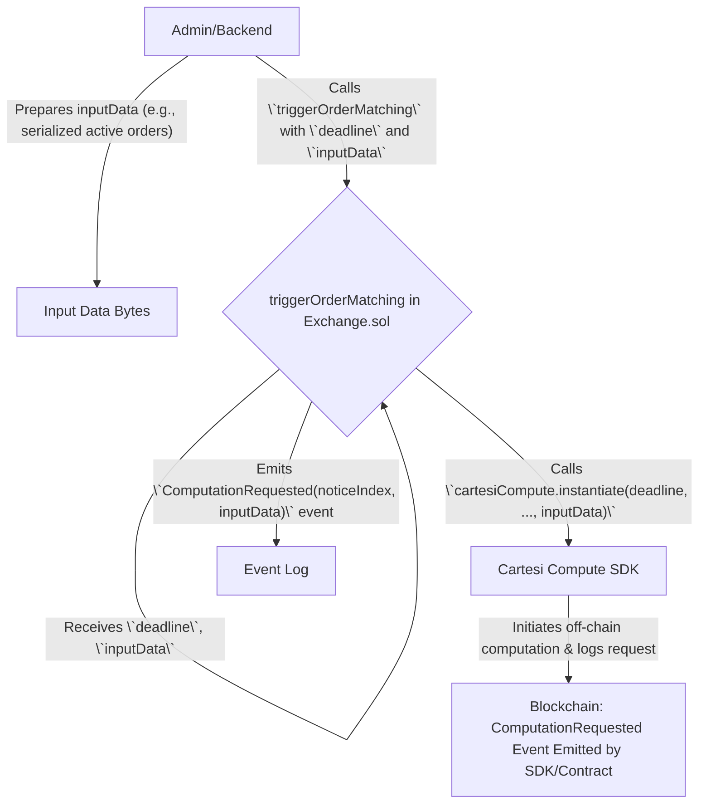
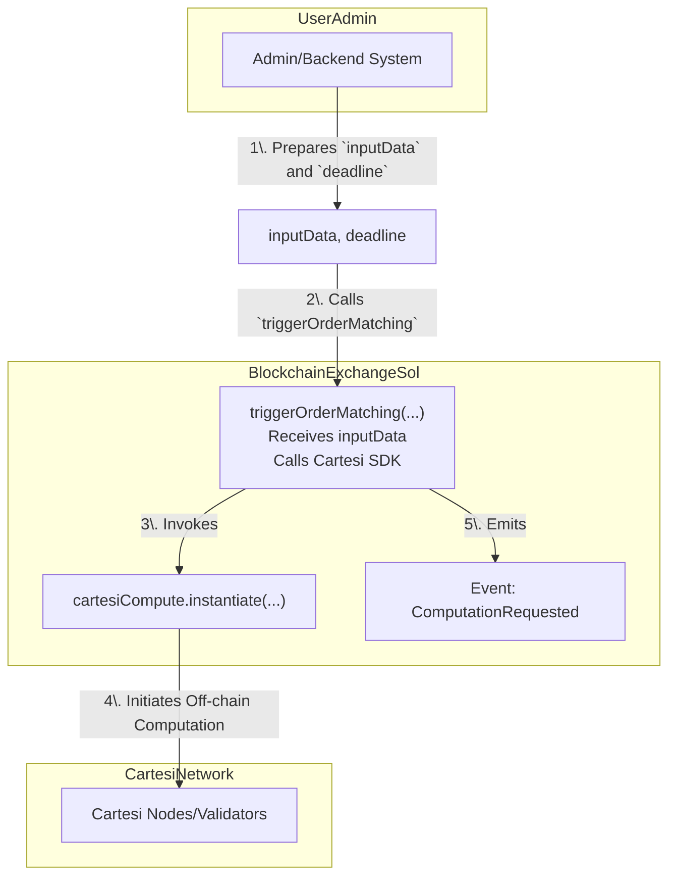
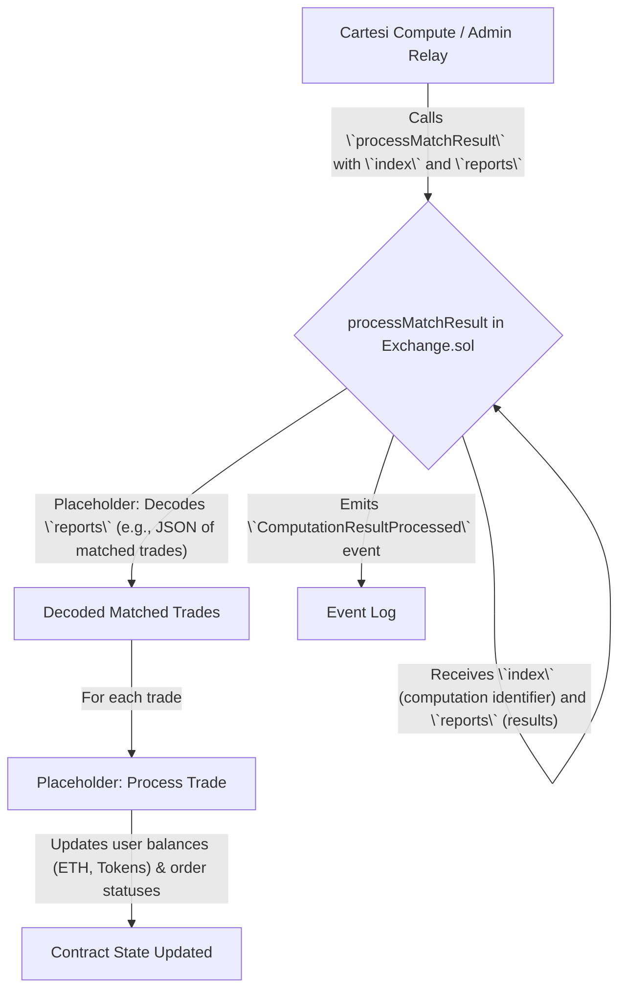
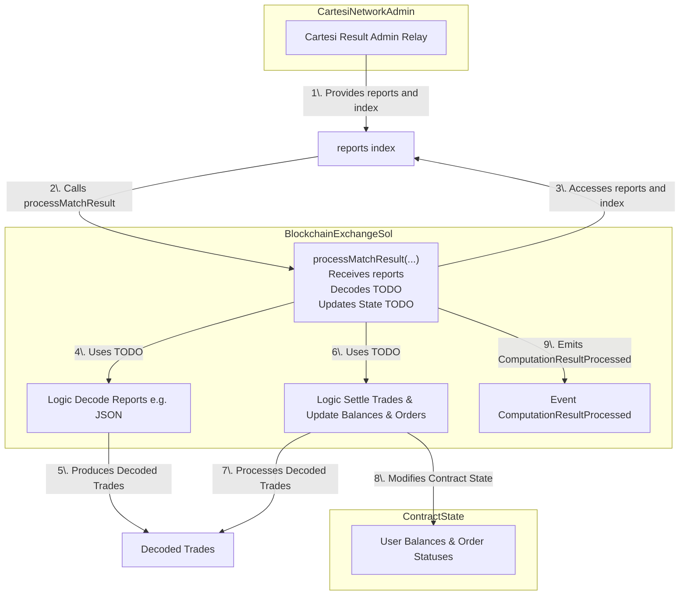

# Order Matching Mechanisms in Exchange.sol

This document analyzes the `triggerOrderMatching` and `processMatchResult` functions within the `Exchange.sol` smart contract. The analysis is based on the project's `README.md` and available code snippets.

## 1. `triggerOrderMatching` Mechanism

**Function Signature (from code snippets):**
`triggerOrderMatching(uint256 deadline, bytes calldata inputData) external override returns (uint256)`

*(Note: The `README.md` also describes a function `triggerOrderMatching(maxOrders, parties)` where the contract itself collects orders. The implemented version above expects `inputData` to be prepared externally.)*

### 1.1. What the function is

This function is responsible for initiating the off-chain order matching process by interacting with the Cartesi Compute SDK. It takes prepared `inputData` (presumably containing serialized order information) and a `deadline` for the computation, then calls the `instantiate` method of the Cartesi Compute SDK.

### 1.2. How the dataflow works

**Files, Functions & Lines:**

*   **File:** `stock-token-exchange/contracts/Exchange.sol`
*   **Function:** `triggerOrderMatching(uint256 deadline, bytes calldata inputData)`
*   **Key Logic (based on typical implementation and snippets):**
    *   Receives `deadline` and `inputData` as parameters.
    *   Calls `cartesiCompute.instantiate(...)` with the provided `deadline`, `inputData`, and other necessary parameters (like `msg.sender` or a designated address for callbacks, and potentially payment for computation).
    *   Emits a `ComputationRequested` event containing the `noticeIndex` (returned by `instantiate`) and the `inputData`.

### 1.3. Implemented and Missing Parts

*   **Implemented:**
    *   `[x]` Function signature and basic structure.
    *   `[x]` Interaction with Cartesi Compute SDK via `cartesiCompute.instantiate(...)`.
    *   `[x]` Emission of `ComputationRequested` event.
*   **Missing/Placeholder (based on snippets and README context):**
    *   `[ ]` **Order Collection & Serialization (if intended to be on-chain):** The current function (as per snippet) expects `inputData` to be pre-formed. If the design goal (as suggested by `README.md`'s `triggerOrderMatching(maxOrders, parties)`) is for the *contract* to gather active orders and serialize them, this logic is missing from this specific function. The `README.md` states: "Contains placeholders for Cartesi input data construction". This seems to refer to the broader system, as this specific function snippet offloads it.
    *   `[ ]` Definition of how `parties` (validators for Cartesi) are determined or passed if required by the specific `instantiate` call beyond what the SDK handles.

### 1.4. How each part functions with the unit test (Unit Testing Strategy)

*   **Mock `cartesiCompute`:** Use a mock version of the `ICartesiCompute` interface.
*   **Test `instantiate` call:**
    *   Prepare sample `inputData` and a `deadline`.
    *   Call `triggerOrderMatching` with these inputs.
    *   Verify that the mock `cartesiCompute.instantiate` function was called with the correct `deadline`, `inputData`, and other expected parameters.
*   **Test Event Emission:**
    *   Verify that the `ComputationRequested` event is emitted with the `noticeIndex` returned by the (mocked) `instantiate` call and the correct `inputData`.

### 1.5. Flow Chart

### 1.6. Next Implementation Step 

1.  **Clarify `inputData` Preparation:** Decide definitively whether `inputData` should be prepared off-chain (as the current snippet suggests) or on-chain by this function (or another).
    *   If on-chain: Implement logic to fetch active orders from storage, filter them (e.g., by `maxOrders`), and serialize them into the format expected by `offchain_logic.py`. This would align more with the `README.md` description of `triggerOrderMatching(maxOrders, parties)`.
2.  **Gas Optimization:** If `inputData` is prepared on-chain and can be large, consider gas optimization techniques or alternative data submission strategies (e.g., submitting hashes and providing data off-chain to validators, though this complicates the Cartesi input mechanism).

### 1.7. Design Issues and Re-design 

1.  **Centralization of Input Preparation:** The current snippet design (where `inputData` is passed in) centralizes the critical step of order selection and serialization to an off-chain component (Admin/Backend).
    *   **Suggestion:** If decentralization/transparency of this step is paramount, revert to a model where the contract itself prepares `inputData` from its state, as implied by the `README.md`'s `triggerOrderMatching(maxOrders, parties)` description. This has gas implications.
2.  **Gas Limit for `inputData`:** Passing large `inputData` directly in the transaction can hit block gas limits.
    *   **Suggestion:** This is a general challenge. If `inputData` is very large, advanced techniques might be needed, but for moderate sizes, careful serialization and off-chain preparation (as currently implied) is more gas-efficient on L1.

---

## 2. `processMatchResult` Mechanism

**Function Signature (from code snippets):**
`processMatchResult(uint256 index, bytes calldata reports) external override`

*(Note: The `README.md` also describes a function `processMatchResult(index)` which then "Retrieves and validates the computation result from Cartesi". The implemented version above expects `reports` (the results) to be passed directly to it, which is consistent with how Cartesi Compute results are often handled via callbacks or relayed transactions.)*

### 2.1. What the function is

This function is responsible for taking the results of the off-chain order matching computation (provided as `reports`) and applying them to the on-chain state. This involves decoding the `reports`, updating user balances (ETH and tokens), and changing the status of orders that were matched.

### 2.2. How the dataflow works

**Files, Functions & Lines:**

*   **File:** `stock-token-exchange/contracts/Exchange.sol`
*   **Function:** `processMatchResult(uint256 index, bytes calldata reports)`
*   **Key Logic (based on typical implementation and snippets):**
    *   Receives `index` (identifying the computation) and `reports` (the actual result data from Cartesi).
    *   **Placeholder:** Contains comments indicating the need to decode `reports` (e.g., `decodeReports(reports)`). This data is expected to conform to the output of `offchain_logic.py`.
    *   **Placeholder:** Contains comments indicating the need to process each trade (e.g., `processTrade(trades[i])`), which involves:
        *   Transferring ETH between buyer and seller.
        *   Transferring stock tokens between seller and buyer.
        *   Updating order statuses (e.g., filled, partially filled).
    *   Emits a `ComputationResultProcessed` event (or more specific events like `TradeExecuted`).

### 2.3. Implemented and Missing Parts

*   **Implemented:**
    *   `[x]` Function signature and basic structure.
    *   `[x]` Parameter for receiving `reports` (computation results).
    *   `[x]` Emission of a generic `ComputationResultProcessed` event.
*   **Missing/Placeholder (based on snippets and README):**
    *   `[ ]` **Result Decoding Logic:** The actual implementation for parsing the `reports` bytes (e.g., from JSON or another format output by `offchain_logic.py`) into a usable data structure (e.g., an array of matched trades) is missing (`decodeReports` is a placeholder).
    *   `[ ]` **State Update Logic:** The core settlement logic to update user ETH balances, token balances, and order statuses based on the decoded trades is missing (`processTrade` is a placeholder).
    *   `[ ]` **Authorization:** The snippet mentions `// require(msg.sender == address(cartesiCompute) || msg.sender == admin, "Unauthorized");`. Proper authorization to ensure only trusted parties (like the Cartesi Compute contract via a callback, or a designated admin) can call this function needs to be robustly implemented.
    *   `[ ]` **Error Handling:** Logic to handle malformed `reports` or results that would lead to inconsistent states.

### 2.4. Unit Testing 

*   **Prepare Mock `reports`:** Create sample `reports` data (byte strings) that simulate valid and invalid outputs from the `offchain_logic.py`.
*   **Test Decoding (once implemented):**
    *   Call `processMatchResult` with mock `reports`.
    *   Verify that the (future) `decodeReports` function correctly parses the data or handles errors for malformed reports.
*   **Test State Updates (once implemented):**
    *   Set up initial user balances and order states.
    *   Call `processMatchResult` with mock `reports` representing successful trades.
    *   Verify that user ETH balances are updated correctly.
    *   Verify that user token balances (requires mocking ERC20 interactions or using an integrated test environment) are updated correctly.
    *   Verify that order statuses are updated (e.g., marked as filled).
*   **Test Event Emission:**
    *   Verify that `ComputationResultProcessed` (and/or more specific events like `TradeExecuted`) are emitted with correct details.
*   **Test Authorization:**
    *   Attempt to call `processMatchResult` from unauthorized accounts and verify failure.
    *   Call from authorized accounts (mocked admin or Cartesi Compute address) and verify success (if other conditions met).

### 2.5. Flow Chart

### 1.6. Next Implementation Step 

1.  **Define `reports` Format:** Finalize and document the exact data structure and serialization format (e.g., JSON schema) for the `reports` generated by `offchain_logic.py`.
2.  **Implement `decodeReports`:** Write the Solidity function to parse the `reports` byte string into an array of structs representing matched trades. Consider gas efficiency, especially if parsing complex structures like JSON.
3.  **Implement `processTrade` (Settlement Logic):**
    *   For each trade, accurately update ETH balances (debit buyer, credit seller).
    *   Accurately update stock token balances (debit seller, credit buyer, ensuring `Exchange.sol` has approval or custody).
    *   Update the `active` status and potentially `filledAmount` of the orders involved.
    *   Handle partial fills if the matching logic supports them.
4.  **Implement Robust Authorization:** Solidify the `msg.sender` check to ensure only authorized entities can submit results.
5.  **Add Detailed Event Emission:** Emit specific events for each trade executed (e.g., `TradeExecuted(orderIdBuy, orderIdSell, amount, price)`), which are more useful for off-chain services and UI updates than a single generic event.
6.  **Error Handling:** Implement checks for invalid trades (e.g., insufficient funds if not already guaranteed by order placement logic, non-existent orders) within the `reports`. Decide on a strategy if a part of the `reports` is invalid (revert all, process valid ones).

### 1.7. Design Issues and Re-design 

1.  **Gas Cost of Processing:** Decoding and processing a batch of trades on-chain can be very gas-intensive, especially if `reports` are complex or involve many trades.
    *   **Suggestion:**
        *   Optimize the `reports` format for easy parsing in Solidity.
        *   Keep on-chain logic per trade as simple as possible.
        *   Consider if the number of trades processed in a single `processMatchResult` call needs to be limited to stay within block gas limits.
2.  **Atomicity and Error Handling in Batch Processing:** If `reports` contain multiple trades, and one fails, the entire transaction will revert. This is generally good for atomicity.
    *   **Suggestion:** Ensure this is the desired behavior. If partial batch processing were ever considered (generally not recommended for financial settlements), it would add significant complexity.
3.  **Trust in `reports` Content (Post-Verification):** While Cartesi provides verifiability of the computation, the `processMatchResult` function still needs to correctly interpret and apply these results. Bugs in the processing logic can lead to incorrect settlements despite a correct off-chain computation.
    *   **Suggestion:** Rigorous testing of the settlement logic is crucial. Formal verification could be considered for this critical component.
4.  **Complexity of `offchain_logic.py` Output:** The more complex the output from `offchain_logic.py`, the harder it is to parse on-chain.
    *   **Suggestion:** Strive for the simplest possible output format from the Cartesi machine that still conveys all necessary information for settlement.
